<!--* Carátula -->

# Informe de Trabajo Final 📙

### Universidad Peruana de Ciencias Aplicadas ♨️

🧑‍💻 **Carrera:** Ingeniería de Software – 2025-02  

**Código y nombre del curso:** [1ASI0729] - [Desarrollo de Aplicaciones Open Source]  

**Sección:** 7414  

**Docente:** Rafael Oswaldo Castro Veramendi  

**Startup:** ProtectX

**Producto:** Sentinel  

  

~~~C#
static string[] Integrantes() {
    return new string[] {
        "🧑‍💻 Ruiz Huisa, Daniel Elias - 202210764",
        "🧑‍💻 Villugas Jeronimo , Liam Anderson - 202211634",
        "👨‍💻 Quiroz Zambrano, Fabrizio Javier - 202213406",
        "👩‍💻 Hermoza Quispe, Jude Alessandro - 202318220",       
        "👩‍💻 De La Cruz Villarreal, Carlos Alejandro - 20211c036, 
    };
}
~~~

Agosto del 2025 🗓️  

---

## Registro de Versiones del Informe
| Versión | Fecha | Descripción | Responsable |
|---------|-------|-------------|-------------|
| 1.0     | 01/09/2025 | Versión inicial | Daniel Ruiz |
| 1.1     | dd/mm/yyyy | Ajustes sección II | Integrante Y |

---

## Project Report Collaboration Insights
> Aquí se registran observaciones del trabajo colaborativo, contribuciones por sprint y aprendizajes.

---

## Contenido del Informe

- [Informe de Trabajo Final 📙](#informe-de-trabajo-final-)
    - [Universidad Peruana de Ciencias Aplicadas ♨️](#universidad-peruana-de-ciencias-aplicadas-️)
  - [Registro de Versiones del Informe](#registro-de-versiones-del-informe)
  - [Project Report Collaboration Insights](#project-report-collaboration-insights)
  - [Contenido del Informe](#contenido-del-informe)
  - [Student Outcome](#student-outcome)
- [Capítulo I: Introducción](#capítulo-i-introducción)
  - [1.1. Startup Profile 📌](#11-startup-profile-)
    - [1.1.1. Descripción de la Startup](#111-descripción-de-la-startup)
    - [1.1.2. Perfiles de integrantes del equipo](#112-perfiles-de-integrantes-del-equipo)
  - [1.2. Solution Profile](#12-solution-profile)
    - [1.2.1. Antecedentes y problemática](#121-antecedentes-y-problemática)
      - [5W’s + 2H’s](#5ws--2hs)
      - [1.2.2. Lean UX Process](#122-lean-ux-process)
      - [1.2.2.1. Lean UX Problem Statements](#1221-lean-ux-problem-statements)
      - [1.2.2.2. Lean UX Assumptions](#1222-lean-ux-assumptions)
    - [Supuestos del Negocio – Sentinel](#supuestos-del-negocio--sentinel)
    - [Supuestos del Cliente – NutriSmart](#supuestos-del-cliente--nutrismart)
      - [1.2.2.3. Lean UX Hypothesis Statements](#1223-lean-ux-hypothesis-statements)
      - [1.2.2.4. Lean UX Canvas](#1224-lean-ux-canvas)
    - [1.3. Segmentos Objetivos](#13-segmentos-objetivos)
      - [Segmento Objetivo 1: Personas que viven solas o familias preocupadas por la seguridad](#segmento-objetivo-1-personas-que-viven-solas-o-familias-preocupadas-por-la-seguridad)
      - [Segmento Objetivo 2: Juntas vecinales y administradores de edificios residenciales](#segmento-objetivo-2-juntas-vecinales-y-administradores-de-edificios-residenciales)
      - [Segmento Objetivo 3: Autoridades locales y serenazgo](#segmento-objetivo-3-autoridades-locales-y-serenazgo)
- [Capítulo II: Requirements Elicitation \& Analysis — ProtectX](#capítulo-ii-requirements-elicitation--analysis--protectx)
  - [2.1. Competidores](#21-competidores)
    - [2.1.1. Análisis competitivo](#211-análisis-competitivo)
    - [2.1.2. Estrategias y tácticas frente a competidores](#212-estrategias-y-tácticas-frente-a-competidores)
  - [2.2. Entrevistas](#22-entrevistas)
    - [2.2.1. Diseño de entrevistas](#221-diseño-de-entrevistas)
    - [2.2.2. Registro de entrevistas](#222-registro-de-entrevistas)
    - [2.2.3. Análisis de entrevistas](#223-análisis-de-entrevistas)
  - [2.3. Needfinding](#23-needfinding)
    - [2.3.1. User Personas](#231-user-personas)
    - [2.3.2. User Task Matrix](#232-user-task-matrix)
    - [2.3.3. User Journey Mapping](#233-user-journey-mapping)
    - [2.3.4. Empathy Mapping](#234-empathy-mapping)
    - [2.3.5. As-is Scenario Mapping](#235-as-is-scenario-mapping)
  - [2.4. Ubiquitous Language](#24-ubiquitous-language)
- [Capítulo III: Requirements Specification](#capítulo-iii-requirements-specification)
  - [3.1. To-Be Scenario Mapping](#31-to-be-scenario-mapping)
  - [3.2. User Stories](#32-user-stories)
  - [3.3. Impact Mapping](#33-impact-mapping)
  - [3.4. Product Backlog](#34-product-backlog)
- [Capítulo IV: Product Design](#capítulo-iv-product-design)
  - [4.1. Style Guidelines](#41-style-guidelines)
    - [4.1.1. General Style Guidelines](#411-general-style-guidelines)
    - [4.1.2. Web Style Guidelines](#412-web-style-guidelines)
  - [4.2. Information Architecture](#42-information-architecture)
    - [4.2.1. Organization Systems](#421-organization-systems)
    - [4.2.2. Labeling Systems](#422-labeling-systems)
    - [4.2.3. SEO Tags and Meta Tags](#423-seo-tags-and-meta-tags)
    - [4.2.4. Searching Systems](#424-searching-systems)
    - [4.2.5. Navigation Systems](#425-navigation-systems)
  - [4.3. Landing Page UI Design](#43-landing-page-ui-design)
    - [4.3.1. Landing Page Wireframe](#431-landing-page-wireframe)
    - [4.3.2. Landing Page Mock-up](#432-landing-page-mock-up)
  - [4.4. Web Applications UX/UI Design](#44-web-applications-uxui-design)
    - [4.4.1. Web Applications Wireframes](#441-web-applications-wireframes)
    - [4.4.2. Web Applications Wireflow Diagrams](#442-web-applications-wireflow-diagrams)
    - [4.4.3. Web Applications Mock-ups](#443-web-applications-mock-ups)
    - [4.4.4. Web Applications User Flow Diagrams](#444-web-applications-user-flow-diagrams)
  - [4.5. Web Applications Prototyping](#45-web-applications-prototyping)
  - [4.6. Domain-Driven Software Architecture](#46-domain-driven-software-architecture)
    - [4.6.1. Software Architecture Context Diagram](#461-software-architecture-context-diagram)
    - [4.6.2. Software Architecture Container Diagrams](#462-software-architecture-container-diagrams)
    - [4.6.3. Software Architecture Components Diagrams](#463-software-architecture-components-diagrams)
  - [4.7. Software Object-Oriented Design](#47-software-object-oriented-design)
    - [4.7.1. Class Diagrams](#471-class-diagrams)
    - [4.7.2. Class Dictionary](#472-class-dictionary)
    - [4.7.2. Class Dictionary](#472-class-dictionary-1)
  - [4.8. Database Design](#48-database-design)
    - [4.8.1. Database Diagram](#481-database-diagram)
- [Capítulo V: Product Implementation, Validation \& Deployment](#capítulo-v-product-implementation-validation--deployment)
  - [5.1. Software Configuration Management](#51-software-configuration-management)
    - [5.1.1. Software Development Environment Configuration](#511-software-development-environment-configuration)
    - [5.1.2. Source Code Management](#512-source-code-management)
    - [5.1.3. Source Code Style Guide \& Conventions](#513-source-code-style-guide--conventions)
    - [5.1.4. Software Deployment Configuration](#514-software-deployment-configuration)
  - [5.2. Landing Page, Services \& Applications Implementation](#52-landing-page-services--applications-implementation)
    - [5.2.X. Sprint n](#52x-sprint-n)
      - [5.2.X.1. Sprint Planning n](#52x1-sprint-planning-n)
      - [5.2.X.2. Aspect Leaders and Collaborators](#52x2-aspect-leaders-and-collaborators)
      - [5.2.X.3. Sprint Backlog n](#52x3-sprint-backlog-n)
      - [5.2.X.4. Development Evidence for Sprint Review](#52x4-development-evidence-for-sprint-review)
      - [5.2.X.5. Execution Evidence for Sprint Review](#52x5-execution-evidence-for-sprint-review)
      - [5.2.X.6. Services Documentation Evidence for Sprint Review](#52x6-services-documentation-evidence-for-sprint-review)
      - [5.2.X.7. Software Deployment Evidence for Sprint Review](#52x7-software-deployment-evidence-for-sprint-review)
      - [5.2.X.8. Team Collaboration Insights during Sprint](#52x8-team-collaboration-insights-during-sprint)
  - [5.3. Validation Interviews](#53-validation-interviews)
    - [5.3.1. Diseño de entrevistas](#531-diseño-de-entrevistas)
    - [5.3.2. Registro de entrevistas](#532-registro-de-entrevistas)
    - [5.3.3. Evaluaciones según heurísticas](#533-evaluaciones-según-heurísticas)
  - [5.4. Video About-the-Product](#54-video-about-the-product)
- [Conclusiones](#conclusiones)
  - [Conclusiones y recomendaciones](#conclusiones-y-recomendaciones)
  - [Video About-the-Team](#video-about-the-team)
- [Bibliografía](#bibliografía)
- [Anexos](#anexos)

---

## Student Outcome
> Describir los resultados de aprendizaje y cómo se alinean con el curso.

---

# Capítulo I: Introducción  

## 1.1. Startup Profile 📌
### 1.1.1. Descripción de la Startup
ProtectX es una startup del sector seguridad que busca responder al problema de la creciente inseguridad ciudadana en Lima y sus alrededores. Ofrece un servicio innovador basado en IoT que, ante cualquier irregularidad, envía una alerta inmediata a la entidad policial más cercana. Su propuesta combina sensores, alarmas y cámaras inteligentes, gestionadas desde una aplicación móvil que centraliza la información. El modelo de negocio se sustenta en un sistema de suscripción por niveles, que permite a los usuarios acceder a mayor cantidad de sensores según sus necesidades. Dirigida a personas que viven solas o que sienten temor por la inseguridad, ProtectX busca proporcionar un ambiente más seguro y fortalecer la protección de cada vivienda.
### 1.1.2. Perfiles de integrantes del equipo  

   <!--TODO: integrante 1 -->
  > 🧑‍💻 <strong>Daniel Elias Ruiz Huisa</strong> 
   

   

     
   

   ~~~txt
   Soy estudiante de Ingeniería de Software en la Universidad Peruana de Ciencias Aplicadas (UPC), actualmente cursando el 6to ciclo de la carrera.
   
   Durante mi formación he adquirido conocimientos en diversas tecnologías y buenas prácticas de desarrollo. Mis principales fortalezas se encuentran lenguajes con orientados fuertemente a la POO como C++ y Java. 

   Adicionalmente, he trabajado con PGAdmin, MongoAtlas, MySQLlite como gestores de bases de datos, y con tecnologías web que me permiten tener una visión integral del desarrollo de software.

   ~~~

   

   

   <!--TODO: integrante 2 -->
  > 🧑‍💻 <strong>Jude Alessandro Hermoza Quispe</strong> 
   

   

     
   

   ~~~txt
   Soy estudiante de Ingeniería de Software en la Universidad Peruana de Ciencias Aplicadas (UPC), actualmente cursando el 5to ciclo de la carrera.

   Me apasiona el desarrollo fullstack y tengo experiencia trabajando con tecnologías como Python, SQL Server, MongoDB y TypeScript. Disfruto aprender nuevas herramientas y lenguajes que me permitan aportar soluciones innovadoras en los proyectos en los que participo.

   Me considero una persona responsable, proactiva y con facilidad para adaptarme a los retos del trabajo en equipo. Aspiro a seguir creciendo profesionalmente y contribuir al desarrollo de software útil y de impacto social.
   ~~~

   

    

   <!--TODO: integrante 3 -->
  > 🧑‍💻 <strong>[Liam Anderson Villugas Jeronimo]</strong> 
   

   

     
   

   ~~~txt
   Soy Estudiante de Ingienieria de Software en la Universidad Peruana de Ciencias Aplicadas (UPC), Estoy cursando actualmente el 6to ciclo de la carrera.

   Me atrae mucho el desarrollo de aplicaciones y el uso de las bases de datos tanto SQL como NoSQL. Cuento con conocimientos en lenguajes en python, Aprendiendo C# y en cuanto a las bases de datos tengo conocimientos de SQLite, SQLserver Y MongoDB.

   Me considero una persona en Aprendizaje constante e intento mantener la tranquilidad bajo prension al trabajar.
   ~~~

   

      

   <!--TODO: integrante 4 -->
  > 🧑‍💻 <strong>[Carlos Alejandro De La Cruz Villarreal]</strong> 

   

     
   

   ~~~txt
Me llamo Carlos soy un estudiante de Ingeniería de Software, tengo 22 años y vivo en Lima.
Mis pasatiempos son hacer deporte, jugar videojuegos y escuchar música. 
Me gusta trabajar en equipo porque de esta manera todos los integrantes podemos dar nuestro 
punto de vista e ideas para poder lograr el objetivo del curso. Además, para este curso me 
comprometo a ayudar en todo lo posible para la elaboración y desarrollo del trabajo

   ~~~

   

      

   <!--TODO: integrante 5 -->
**> 🧑‍💻 Fabrizio Javier Quiroz Zambrano (U202213406)**
   

   

   ~~~txt
    Actualmente curso el sexto ciclo de Ingeniería de Software en la Universidad Peruana de Ciencias Aplicadas (UPC), donde he venido desarrollando una sólida base técnica y una visión crítica
    sobre el desarrollo de soluciones digitales. Mi formación me ha permitido explorar distintos lenguajes y herramientas, desde la lógica estructurada de C++ hasta el dinamismo de frameworks
    modernos como Angular, con los que he trabajado principalmente en el frontend. También tengo experiencia en Python y SQL, lo que me ha ayudado a comprender mejor la gestión de datos y la
    construcción de aplicaciones más completas.

    Más allá de lo técnico, me considero una persona comprometida con el aprendizaje constante, con facilidad para adaptarme a nuevos entornos y colaborar en equipo. Me gusta enfrentar desafíos
    que me obliguen a pensar fuera de lo convencional y a buscar soluciones eficientes y sostenibles.

    Tengo grandes expectativas para el curso de Desarrollo de Aplicaciones Open Source, ya que representa una oportunidad para fortalecer mis habilidades en el desarrollo fullstack y familiarizarme con nuevas tecnologías
    como Vue. Estoy convencido de que este tipo de experiencias me acercan cada vez más al perfil profesional que quiero construir: uno capaz de crear software útil, escalable y centrado en las personas.
   ~~~

   

---

## 1.2. Solution Profile
### 1.2.1. Antecedentes y problemática  

<b>Problemática general</b>
En Lima y sus alrededores, la inseguridad ciudadana se ha convertido en una de las principales preocupaciones de la población. El aumento de robos, asaltos y delitos contra la propiedad ha superado la efectividad de los métodos tradicionales de protección, como rejas o rondas vecinales, generando una creciente sensación de vulnerabilidad. Este escenario plantea la necesidad de soluciones más eficientes que respondan a la magnitud del problema.

<b>Dimensión social</b>
La inseguridad no solo afecta el patrimonio de los ciudadanos, sino también su bienestar emocional. Muchas personas viven con miedo constante, lo que reduce su calidad de vida y limita su libertad de movimiento, especialmente en sectores donde los índices delictivos son más altos. Este clima de temor generalizado genera desconfianza en la comunidad, debilitando los lazos sociales y reforzando la percepción de que los hogares no son espacios plenamente seguros.

<b>Dimensión económica</b>
El impacto económico de la inseguridad se refleja en pérdidas materiales por robos, daños en las viviendas y el gasto recurrente en medidas de protección tradicionales que resultan insuficientes. Además, obliga a las familias a destinar recursos adicionales a reforzar la seguridad, lo que representa una carga financiera significativa. En conjunto, estos costos reducen la capacidad de ahorro y afectan la economía doméstica, evidenciando que la inseguridad es también un problema que compromete la estabilidad financiera de los hogares.

#### 5W’s + 2H’s
 🟢 **WHAT (Qué)**  
  Creciente ola de inseguridad ciudadana caracterizada por robos, asaltos y delitos contra la propiedad.  

 🟢 **WHEN (Cuándo)**  
  Actualmente, con mayor incidencia en los últimos años debido al incremento sostenido de la criminalidad.  

 🟢 **WHERE (Dónde)**  
  Principalmente en Lima Metropolitana y zonas aledañas con altos índices delictivos.  

 🟢 **WHO (Quién)**  
  Ciudadanos en general, con especial impacto en personas que viven solas o con temor frente a la inseguridad.  

 🟢 **WHY (Por qué)**  
  Falta de respuestas rápidas y efectivas ante emergencias, limitada capacidad de cobertura policial y deficiencia en las medidas tradicionales de seguridad.  

 🟢 **HOW (Cómo)**  
  Las personas recurren a rejas, cerraduras, cámaras convencionales o rondas vecinales, pero estas acciones resultan insuficientes frente a la magnitud del problema.  

 🟢 **HOW MUCH (Cuánto)**   
 El costo se refleja en pérdidas materiales por robos, daños en viviendas y una carga financiera extra para las familias, además del impacto social derivado del miedo y la desconfianza.

#### 1.2.2. Lean UX Process

#### 1.2.2.1. Lean UX Problem Statements
Los ciudadanos preocupados por la inseguridad en Lima y los profesionales encargados de la protección vecinal enfrentan dificultades para acceder a soluciones de seguridad que sean realmente efectivas, rápidas y adaptadas a sus necesidades particulares.

Hemos observado que muchos usuarios sienten que los sistemas tradicionales (rejas, alarmas convencionales, rondas vecinales) no ofrecen una respuesta inmediata ni una integración tecnológica suficiente, lo que genera desconfianza y baja percepción de seguridad en sus hogares.

¿Cómo podríamos diseñar un sistema de alerta y monitoreo inteligente que incremente la sensación de seguridad y permita una respuesta más rápida ante incidentes?

#### 1.2.2.2. Lean UX Assumptions

**Assumptions Worksheet**

### Supuestos del Negocio – Sentinel

1. **Creo que mis clientes tienen la necesidad de:**  
   Contar con un sistema de seguridad inteligente que brinde alertas inmediatas y centralice la información de sensores, cámaras y alarmas, permitiendo una respuesta rápida ante emergencias.

2. **Estas necesidades pueden resolverse con:**  
   Sentinel, una solución IoT que integra sensores, cámaras y alarmas inteligentes, gestionadas desde una aplicación móvil, conectada directamente con entidades policiales y vecinos.

3. **Mis clientes iniciales son (o serán):**  
   - Personas que viven solas o en zonas de alta inseguridad.
   - Familias preocupadas por la protección de su vivienda.
   - Juntas vecinales y administradores de edificios residenciales.

4. **El principal valor que un cliente quiere obtener de mi servicio es:**  
   Seguridad y tranquilidad, gracias a la capacidad de recibir alertas inmediatas y monitorear su hogar en tiempo real.  
   **También pueden obtener estos beneficios adicionales:**  
   Facilidad de uso, integración con autoridades, historial de eventos y personalización de niveles de protección.

5. **Adquiriré la mayoría de mis clientes a través de:**  
   - Recomendaciones de boca a boca en comunidades y vecindarios.
   - Alianzas con inmobiliarias y juntas vecinales.
   - Campañas digitales enfocadas en zonas de alta incidencia delictiva.

6. **Ganaré dinero mediante:**  
   - Suscripciones mensuales por niveles de servicio.
   - Venta de kits de sensores y cámaras inteligentes.
   - Servicios premium de monitoreo y soporte técnico.

7. **Mi principal competencia en el mercado será:**  
   Empresas de alarmas tradicionales y sistemas de cámaras convencionales.  
   **Superaremos a la competencia debido a:**  
   Nuestra integración IoT, respuesta automatizada y conexión directa con autoridades.

8. **El mayor riesgo de mi producto es:**  
   Que los usuarios no confíen en la efectividad del sistema o no perciban una mejora real en la seguridad.  
   **Lo resolveremos mediante:**  
   Pilotos en comunidades, testimonios de usuarios y mejoras continuas basadas en feedback.

9. **Otras suposiciones que, si se demuestran falsas, harán que nuestro negocio fracase:**  
   - Que los usuarios estén dispuestos a pagar por un sistema de seguridad inteligente.
   - Que las autoridades colaboren en la integración de alertas.
   - Que la tecnología funcione de manera confiable en diferentes entornos urbanos.

### Supuestos del Cliente – NutriSmart

1. **¿Quién es el cliente?**  
   Personas y familias que buscan mejorar la seguridad de su vivienda, especialmente quienes viven en zonas de alta incidencia delictiva, así como juntas vecinales y administradores de edificios.

2. **¿Dónde encaja nuestro producto en su vida?**  
   En la rutina diaria: al salir o llegar a casa, al monitorear la vivienda desde el móvil, o ante cualquier evento sospechoso detectado por los sensores.

3. **¿Qué problemas soluciona nuestro producto?**  
   - Falta de respuesta inmediata ante emergencias.
   - Dificultad para monitorear el hogar en tiempo real.
   - Limitada integración entre vecinos y autoridades.
   - Ineficiencia de sistemas tradicionales de seguridad.

4. **¿Cuándo y cómo se utiliza nuestro producto?**  
   - Uso diario: monitoreo desde la app, recepción de alertas.
   - En situaciones de emergencia: activación automática de alarmas y notificaciones.
   - Acceso desde dispositivos móviles y web.

5. **¿Qué características son importantes?**  
   - Alertas inmediatas y automáticas.
   - Integración de sensores, cámaras y alarmas.
   - Facilidad de uso y configuración.
   - Historial de eventos y personalización de notificaciones.

6. **¿Cómo debe verse y comportarse nuestro producto?**  
   - Interfaz intuitiva y moderna.
   - Acceso rápido a información crítica.
   - Notificaciones claras y en tiempo real.
   - Adaptable a distintos perfiles de usuario.

**Lean & Hypothesis - Driven Development**

#### 1.2.2.3. Lean UX Hypothesis Statements

<!-- Segmento 1: Personas que viven solas o familias preocupadas por la seguridad -->
**1ra Hipótesis**  
**Creemos que** ofrecer alertas automáticas e inmediatas a través de la app Sentinel aumentará la percepción de seguridad de los usuarios.  
**Sabremos que estamos bien cuando** los usuarios reporten sentirse más seguros y se reduzca el tiempo de respuesta ante incidentes en al menos un 30% durante pruebas piloto.

---

**2da Hipótesis**  
**Creemos que** permitir la personalización de niveles de protección y notificaciones incrementará la satisfacción y el uso continuo del sistema.  
**Sabremos que esto es cierto cuando** más del 60% de los usuarios ajusten sus configuraciones y mantengan el servicio activo después del primer mes.

---

**3ra Hipótesis**  
**Creemos que** integrar un historial de eventos accesible desde la app aumentará la confianza y el sentido de control de los usuarios.  
**Sabremos que esto es cierto cuando** al menos el 70% de los usuarios consulten el historial al menos una vez por semana.

---

<!-- Segmento 2: Juntas vecinales y administradores de edificios residenciales -->
**4ta Hipótesis**  
**Creemos que** la función de alertas comunitarias permitirá una mejor coordinación entre vecinos ante emergencias.  
**Sabremos que esto es cierto cuando** al menos el 50% de las alertas sean respondidas por más de un usuario de la comunidad.

---

**5ta Hipótesis**  
**Creemos que** ofrecer reportes de seguridad y estadísticas mensuales facilitará la toma de decisiones en la gestión vecinal.  
**Sabremos que esto es cierto cuando** los administradores descarguen o consulten los reportes al menos una vez al mes.

---

**6ta Hipótesis**  
**Creemos que** la integración de chat o foros internos fortalecerá la colaboración y comunicación entre vecinos.  
**Sabremos que esto es cierto cuando** se registre un aumento del 40% en la interacción entre usuarios dentro de la plataforma.

---

<!-- Segmento 3: Autoridades locales y serenazgo -->
**7ma Hipótesis**  
**Creemos que** la recepción de alertas en tiempo real permitirá a las autoridades responder más rápido a incidentes reportados por Sentinel.  
**Sabremos que esto es cierto cuando** el tiempo promedio de respuesta disminuya en al menos un 25% en zonas piloto.

---

**8va Hipótesis**  
**Creemos que** el acceso a mapas de calor y reportes de incidentes ayudará a las autoridades a optimizar la vigilancia y patrullaje.  
**Sabremos que esto es cierto cuando** las rutas de patrullaje se ajusten en función de los datos proporcionados por Sentinel.

---

**9na Hipótesis**  
**Creemos que** la posibilidad de enviar mensajes o recomendaciones directas a los usuarios desde la plataforma mejorará la percepción de cercanía y apoyo de las autoridades.  
**Sabremos que esto es cierto cuando** al menos el 60% de los usuarios valore positivamente la comunicación recibida en encuestas de satisfacción.

---
#### 1.2.2.4. Lean UX Canvas

A continuación se puede visualizar el Lean UX Canvas donde se estructura y valida rápidamente ideas de producto.

  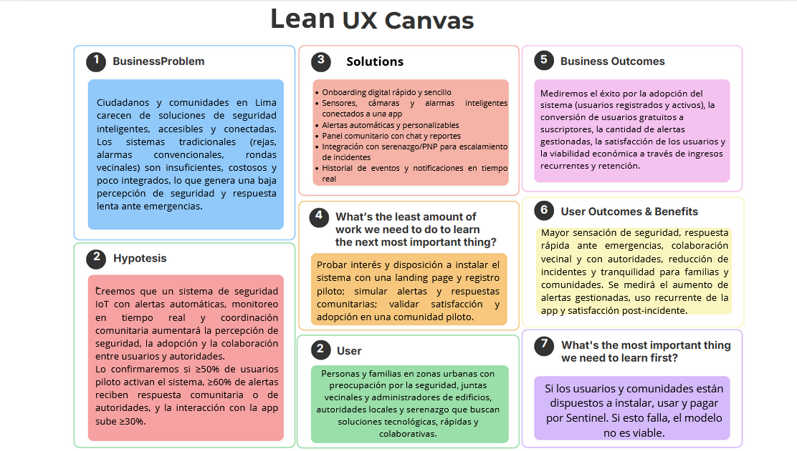

Visualizar diseño en Canva: https://www.canva.com/design/DAGzfYolLXw/sM_8Lj1iXQqIqoAouRbbsQ/edit
---
### 1.3. Segmentos Objetivos

#### Segmento Objetivo 1: Personas que viven solas o familias preocupadas por la seguridad

**Aspectos Demográficos:**
- **Sexo:** Masculino y femenino
- **Edades:** 25 a 65 años
- **Nivel Socioeconómico:** Clases B, C y D (media, media-baja y baja)
- **Ocupación:** Trabajadores dependientes, independientes, amas de casa, adultos mayores
- **Ingresos:** Ingresos medios o bajos, con preocupación por proteger su patrimonio

**Aspectos Geográficos:**
- **Ubicación:** Lima Metropolitana y zonas urbanas/periurbanas con alta incidencia delictiva
- **Acceso a tecnología:** Uso frecuente de smartphones y acceso a internet móvil

**Aspectos Psicográficos:**
- **Motivaciones:** Proteger a su familia y bienes, reducir el miedo y la ansiedad por la inseguridad
- **Estilo de vida:** Hogareño, con preocupación constante por la seguridad del entorno
- **Preocupaciones:** Robos, asaltos, respuesta lenta de autoridades, falta de soluciones tecnológicas accesibles
- **Adaptación a la tecnología:** Disposición a usar apps móviles si son fáciles y útiles

---

#### Segmento Objetivo 2: Juntas vecinales y administradores de edificios residenciales

**Aspectos Demográficos:**
- **Sexo:** Masculino y femenino
- **Edades:** 30 a 65 años
- **Nivel Socioeconómico:** Clases B y C (media y media-baja)
- **Ocupación:** Líderes vecinales, administradores de edificios, representantes comunales

**Aspectos Geográficos:**
- **Ubicación:** Urbanizaciones, condominios y edificios en zonas con problemas de seguridad
- **Acceso a tecnología:** Uso de computadoras y smartphones para gestión y comunicación

**Aspectos Psicográficos:**
- **Motivaciones:** Mejorar la seguridad colectiva, fortalecer la colaboración entre vecinos y con autoridades
- **Estilo de vida:** Proactivos en la gestión comunitaria, buscan soluciones integrales y tecnológicas
- **Preocupaciones:** Coordinación eficiente ante emergencias, falta de herramientas para monitoreo y alerta comunitaria
- **Adaptación a la tecnología:** Alta disposición a implementar soluciones digitales que faciliten la gestión y comunicación

---

#### Segmento Objetivo 3: Autoridades locales y serenazgo

**Aspectos Demográficos:**
- **Sexo:** Masculino y femenino
- **Edades:** 25 a 60 años
- **Ocupación:** Personal de serenazgo, policías municipales, funcionarios de seguridad ciudadana

**Aspectos Geográficos:**
- **Ubicación:** Municipios y distritos de Lima y alrededores

**Aspectos Psicográficos:**
- **Motivaciones:** Mejorar la capacidad de respuesta y monitoreo, optimizar recursos y coordinación con la comunidad
- **Preocupaciones:** Falta de información en tiempo real, dificultad para priorizar emergencias, baja colaboración vecinal
- **Adaptación a la tecnología:** Interés en herramientas que automaticen alertas y centralicen información para la toma de decisiones

---

# Capítulo II: Requirements Elicitation & Analysis — ProtectX

## 2.1. Competidores

### 2.1.1. Análisis competitivo

> Criterios de comparación: público objetivo principal, complejidad de instalación/uso, costo aproximado, foco geográfico, y capacidades clave (detección, monitoreo, evidencia, colaboración comunitaria, escalamiento a autoridades).

| Competidor | Enfoque | Fortalezas | Debilidades | Ventaja de ProtectX |
|------------|---------|------------|-------------|----------------------|
| **Verisure (Securitas Direct)** | Alarmas con monitoreo 24/7 para hogares y negocios. | Marca reconocida, instalación profesional, coordinación con serenazgo/PNP. | Contratos largos y costosos, poco flexible para juntas vecinales. | ProtectX es modular, con auto-instalación guiada, alertas inmediatas y funciones de comunidad. |
| **ADT** | Sistemas de alarma y sensores para el hogar. | Experiencia global, soporte confiable, ecosistema robusto. | Menor integración comunitaria y adaptación local limitada. | ProtectX integra comunidad + hogares con costos escalables y protocolos de respuesta locales. |
| **Securitas Perú (B2B)** | Seguridad corporativa (monitoreo, CCTV, control de acceso). | Portafolio amplio, servicios gestionados, SOC 24/7. | Costos elevados, pensado para empresas, no hogares. | ProtectX empaqueta lo esencial en una solución accesible para familias, juntas y autoridades locales. |
| **Ring (Amazon)** | Cámaras/timbres inteligentes con app móvil. | Interfaz simple, ecosistema smart home, fácil adopción. | Sin vínculo con autoridades locales; soporte LATAM limitado. | ProtectX conecta sensores/cámaras a serenazgo/PNP y fomenta coordinación vecinal. |
| **Hikvision / Dahua (kits IoT)** | Cámaras y alarmas con analítica perimetral. | Amplia oferta, disponibilidad en Perú, hardware sólido. | Requiere configuración técnica, apps dispersas, sin monitoreo nativo. | ProtectX centraliza sensores + cámaras en una sola app con escalamiento automático de alertas. |
| **SimpliSafe** | Alarmas con autoservicio. | Instalación sencilla, app clara. | No disponible oficialmente en LATAM; sin coordinación comunitaria. | ProtectX es local-first, con comunidad y autoridades integradas en el flujo de respuesta. |
| **Aseguradoras con servicios de alarma** | Paquetes de seguro + monitoreo. | Credibilidad, soporte integral. | Planes caros, poco flexibles, sin comunidad. | ProtectX es más accesible, escalable y diseñado para Lima Metropolitana. |

**Resumen de ventaja competitiva de ProtectX**  
- **Localización en Lima/Perú**: rutas de alerta a serenazgo/PNP configuradas por distrito.  
- **Modelo IoT modular**: escalable por sensores y niveles de suscripción (hogar → edificio → comunidad).  
- **Colaboración comunitaria**: mapa de incidentes, chat vecinal, evidencia compartida en tiempo real.  
- **Accesibilidad**: auto-instalación, costos escalables, interfaz simple y multisegmento.  

---

### 2.1.2. Estrategias y tácticas frente a competidores

- **Posicionamiento**: “La seguridad inteligente y comunitaria de Lima: detección, evidencia y coordinación con vecinos y autoridades en una sola app”.  
- **Go-to-market**:  
  - Pilotos en distritos con alta incidencia delictiva.  
  - Alianzas con juntas vecinales, inmobiliarias y municipalidades.  
  - Testimonios y campañas digitales segmentadas por zona.  
- **Producto**:  
  - **Hogares**: botón de pánico, alertas inmediatas, 2–4 sensores básicos.  
  - **Juntas vecinales**: tablero comunitario, permisos por roles, reportes mensuales.  
  - **Autoridades locales**: mapas de calor, evidencias en un clic, comunicación directa.  
- **Educación y confianza**: protocolos de privacidad, cifrado de datos, SLA de notificaciones.  
- **Modelo de ingresos**:  
  - Suscripciones mensuales por niveles.  
  - Kits iniciales de sensores/cámaras.  
  - Servicios premium de monitoreo y soporte técnico.  

---

## 2.2. Entrevistas

### 2.2.1. Diseño de entrevistas

**Segmentos objetivo**

1. **Personas/familias que viven solas o con temor por la inseguridad (hogares).**  
2. **Juntas vecinales y administradores de edificios residenciales.**  
3. **Autoridades locales y serenazgo.**

**Preguntas por Segmento Objetivo**

**A. Hogares**  
1. ¿Qué incidentes de seguridad has experimentado en tu vivienda en los últimos 12 meses?  
2. ¿Qué métodos de seguridad utilizas actualmente y qué limitaciones encuentras en ellos?  
3. ¿Qué características te darían confianza para pagar por un sistema de seguridad inteligente?  
4. ¿Qué tipo de alertas en el celular considerarías más útiles en caso de emergencia?  
5. ¿Cuál sería un precio justo por un servicio que combine sensores, cámaras y alertas inmediatas?

**B. Juntas vecinales / Administradores**  
1. ¿Cómo se organizan actualmente ante incidentes en su comunidad?  
2. ¿Qué problemas tienen al coordinar con serenazgo o PNP?  
3. ¿Qué información necesitan en un tablero comunitario para decidir rápido?  
4. ¿Qué nivel de personalización requieren en permisos de acceso a cámaras o alertas?  
5. ¿Qué esquema de suscripción sería más viable: por unidad habitacional, por sensor común o por administración?

**C. Autoridades locales / Serenazgo**  
1. ¿Qué dificultades enfrentan hoy para responder a incidentes vecinales?  
2. ¿Qué tipo de información en tiempo real les facilitaría priorizar emergencias?  
3. ¿Cómo debería integrarse un sistema de seguridad comunitario con sus protocolos actuales?  
4. ¿Qué formato de evidencia (video, fotos, reportes automáticos) sería más útil para agilizar su respuesta?  
5. ¿Qué expectativas tendrían respecto a la colaboración ciudadana mediante apps como ProtectX?

---

### 2.2.2. Registro de entrevistas

| Entrevistado | Segmento | Fecha      | Video                                                                                                                            |
|--------------|----------|------------|----------------------------------------------------------------------------------------------------------------------------------|
| INT-001      | Hogar    | 08/09/2025 |  |
| INT-002      | Junta/Administrador | 16-09-2025 |                                                           |
| INT-003      | Autoridad/Serenazgo | AAAA-MM-DD |                                                                                        |

| … | … | … | … |

---

### 2.2.3. Análisis de entrevistas

- **Patrones comunes:** [Ej. necesidad de evidencias rápidas; coordinación débil; percepción de inseguridad alta].  
- **Diferencias por segmento:**  
  - **Hogares:** buscan sencillez, bajo costo y botón de pánico inmediato.  
  - **Juntas vecinales:** necesitan tableros comunitarios, permisos y reportes periódicos.  
  - **Autoridades:** demandan información en tiempo real, formatos estandarizados y mapas de incidentes.  
- **Conclusiones:** [Definir funcionalidades prioritarias del MVP hogar, comunidad y autoridad; validar supuestos de pago y confianza tecnológica].  

---

## 2.3. Needfinding
### 2.3.1. User Personas  

A continuación presentamos los user personas identificadas basándonos en las entrevistas realizadas para ambos segmentos objetivos. Estos user personas nos ayudarán a entender mejor las necesidades y expectativas de nuestros futuros usuarios.

Segmento 1: **Hogares**

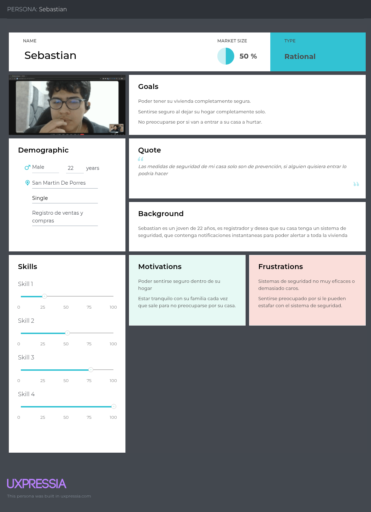

Segmento 2: **Juntas vecinales**

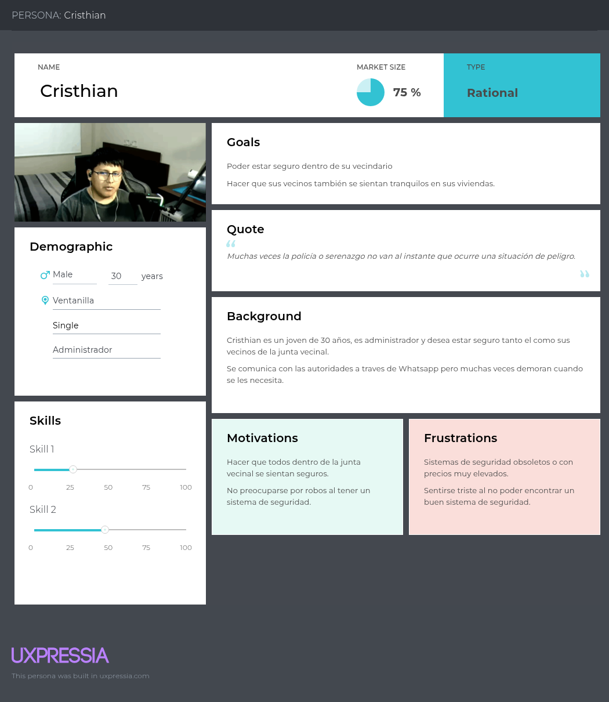

### 2.3.2. User Task Matrix  

<table>
  <tr>
    <th rowspan="2" valign="top"><b><i>User Task Matrix</i></b></th>
    <th colspan="2" valign="top"><b><i>Cristian (Administrador vecinal)</i></b></th>
    <th colspan="2" valign="top"><b><i>Sebastián (Residente joven)</i></b></th>
  </tr>
  <tr>
    <td valign="top"><b><i>Frecuencia</i></b></td>
    <td valign="top"><b><i>Importancia</i></b></td>
    <td valign="top"><b><i>Frecuencia</i></b></td>
    <td valign="top"><b><i>Importancia</i></b></td>
  </tr>
  <tr>
    <td>Coordinar con serenazgo o PNP ante incidentes</td>
    <td><b><i>Siempre</i></b></td>
    <td><b><i>Alta</i></b></td>
    <td><b><i>Rara vez</i></b></td>
    <td><b><i>Alta</i></b></td>
  </tr>
  <tr>
    <td>Reunir y organizar a vecinos para temas de seguridad</td>
    <td><b><i>A menudo</i></b></td>
    <td><b><i>Alta</i></b></td>
    <td><b><i>Nunca</i></b></td>
    <td><b><i>Baja</i></b></td>
  </tr>
  <tr>
    <td>Reportar emergencias en grupos vecinales (WhatsApp)</td>
    <td><b><i>Siempre</i></b></td>
    <td><b><i>Alta</i></b></td>
    <td><b><i>A menudo</i></b></td>
    <td><b><i>Media</i></b></td>
  </tr>
  <tr>
    <td>Supervisar o revisar sistemas de cámaras comunitarias</td>
    <td><b><i>A veces</i></b></td>
    <td><b><i>Media</i></b></td>
    <td><b><i>Nunca</i></b></td>
    <td><b><i>Baja</i></b></td>
  </tr>
  <tr>
    <td>Verificar y proteger la vivienda propia</td>
    <td><b><i>A veces</i></b></td>
    <td><b><i>Media</i></b></td>
    <td><b><i>Siempre</i></b></td>
    <td><b><i>Alta</i></b></td>
  </tr>
  <tr>
    <td>Recibir notificaciones inmediatas de alertas de intrusión</td>
    <td><b><i>A veces</i></b></td>
    <td><b><i>Alta</i></b></td>
    <td><b><i>Siempre</i></b></td>
    <td><b><i>Alta</i></b></td>
  </tr>
</table>

**Tareas con mayor frecuencia e importancia**

Cristian: destacan la coordinación con serenazgo o PNP, la organización de vecinos y el reporte de emergencias en grupos comunitarios, todas catalogadas como frecuentes y de alta importancia. Esto refleja su rol orientado a la gestión colectiva y liderazgo comunitario.

Sebastián: sobresalen la verificación y protección de su vivienda y el recibo de notificaciones inmediatas de alertas, que realiza siempre y considera altamente importantes. Esto evidencia su enfoque en la seguridad personal y doméstica.

**Diferencias principales**

Cristian prioriza la coordinación comunitaria y comunicación colectiva, mientras que Sebastián se centra en la protección individual.

Sebastián siempre verifica y protege su vivienda, mientras que Cristian solo lo hace a veces, ya que su preocupación está más en lo comunitario que en lo personal.

**Coincidencias**

Ambos consideran de alta importancia recibir notificaciones inmediatas de alertas de intrusión, aunque la frecuencia es mayor en Sebastián.

Tanto Cristian como Sebastián ven esencial contar con mecanismos de respuesta ante emergencias, ya sea de forma colectiva (Cristian) o personal (Sebastián).

### 2.3.3. User Journey Mapping  

Segmento Objetivo 1: **Hogares**

Se puede evidenciar como es el proceso de selección de Sebastian al momento de elegir un sistema de seguridad para su hogar, 
por el momento se encuentra frustrado pues los sistemas de seguridad que tenía son obsoletos.

Segmento Objetivo 2: **Juntas vecinales**

Se puede ver como los vecinos sienten que las opciones que encuentran de sistemas de seguridad, 
no son 100% confiables y temen ser estafados.

### 2.3.4. Empathy Mapping 

Segmento Objetivo 1: **Hogares**

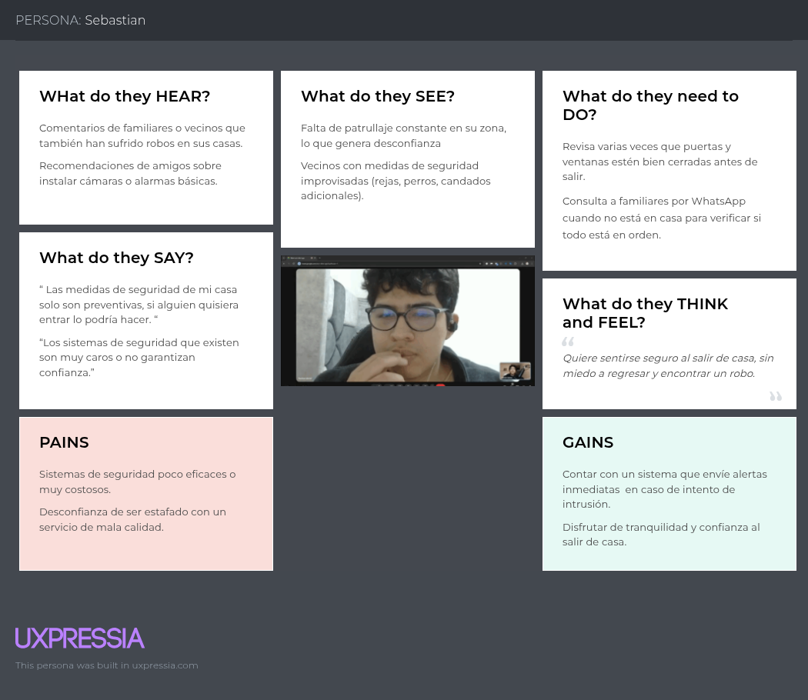

Segmento Objetivo 2: **Juntas vecinales**

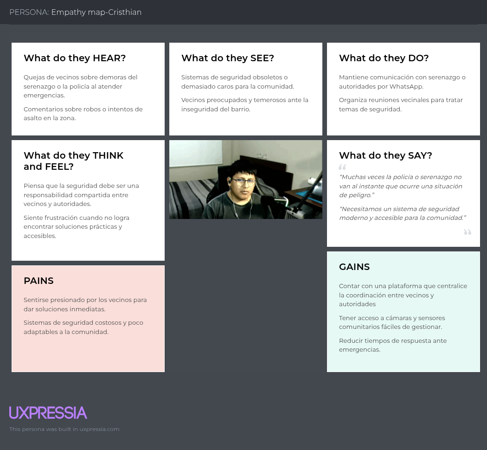

### 2.3.5. As-is Scenario Mapping  

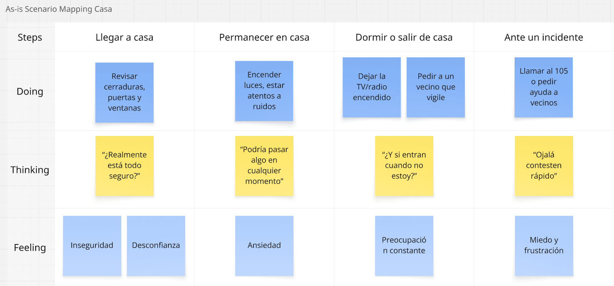

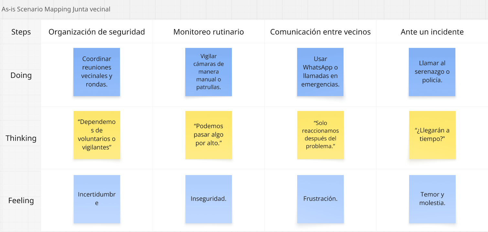

## 2.4. Ubiquitous Language  

Sensor IoT : Dispositivo conectado  que recopila datos de la vivienda y los transmite al sistema.

Suscriptor : Persona registrada que contrata un plan de suscripción.

Alerta Inmediata : Notificación en tiempo real enviada al usuario y a la entidad policial más cercana a través de una aplicación.

Cámara Inteligente: Dispositivo de video con detección avanzada que transmite imágenes en vivo a la app y respalda evidencias de seguridad.

Framework:Estructura de desarrollo que define buenas prácticas y provee herramientas para construir software escalable; en ProtectX se usa Spring Boot para el backend y Angular para el frontend.

Angular: Framework de desarrollo frontend en TypeScript usado para construir la aplicación ProtectX, ofreciendo modularidad mediante componentes y servicios.

IDE: Entorno de Desarrollo Integrado

# Capítulo III: Requirements Specification  

## 3.1. To-Be Scenario Mapping  

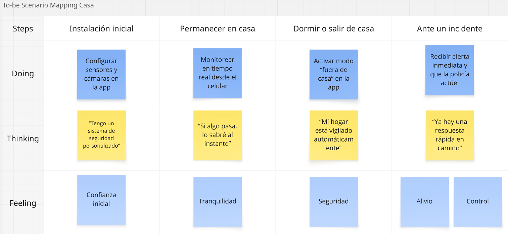

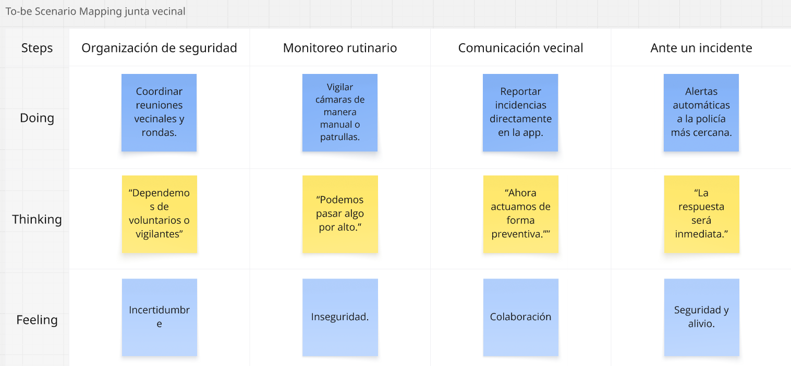

## 3.2. User Stories  

| Epic ID | Título                                         | Descripción |
|---------|------------------------------------------------|-------------|
| EPIC-01 | Información del producto               | Como visitante, quiero entender qué es Sentinel y cómo funciona, para evaluar si resuelve mi necesidad de seguridad. |
| EPIC-02 | Planes y suscripción              | Como usuario potencial, quiero ver y comparar planes de suscripción, para elegir el que se adapte a mi hogar o comunidad. |
| EPIC-03 | Testimonios y confianza         | Como visitante, quiero ver testimonios y casos de éxito, para confiar en la solución antes de registrarme. |
| EPIC-04 | Registro y login                   | Como usuario, quiero registrarme e iniciar sesión desde la landing, para acceder a mi cuenta y servicios contratados. |
| EPIC-05 | Portal de administradores                   | Como administrador de edificio o junta vecinal, quiero acceder a un portal exclusivo, para gestionar la seguridad comunitaria. |
| EPIC-06 |Developer Hub             | Como desarrollador, quiero acceder a documentación técnica y API keys desde la landing, para integrar Sentinel en otras plataformas. |
| EPIC-07 | Contacto y soporte            | Como usuario interesado, quiero un canal directo de contacto, para resolver dudas o pedir más información. |

| ID   | Título                                                   | Descripción                                                                                                                                      | Criterios de aceptación | EpicID |
|------|----------------------------------------------------------|--------------------------------------------------------------------------------------------------------------------------------------------------|--------------------------|--------|
| US01 |Introducción clara | Como visitante, quiero entender qué es Sentinel y cómo funciona, para evaluar si resuelve mi necesidad de seguridad. | **Escenario 1:** Dado que el visitante ingresa a la landing, cuando carga la página, entonces debe ver un texto introductorio que explique qué es Sentinel. **Escenario 2:** Dado que el visitante baja en la página, cuando llega a la sección de producto, entonces aparecen iconos o gráficos representativos. | EPIC-01 |
| US02 | Funcionalidad IoT |Como visitante, quiero ver ejemplos de sensores y la app en la landing, para comprender cómo funciona la solución.  |**Escenario 1:** Dado que el visitante está en la sección de producto, cuando revisa los ejemplos, entonces debe ver imágenes de sensores y pantallas de la app. **Escenario 2:** Dado que el visitante pasa el mouse o toca los elementos gráficos, cuando interactúa, entonces debe desplegarse una breve descripción de cada dispositivo. | EPIC-01 |
| US03 | Casos de uso colectivos |Como junta vecinal interesada, quiero ver ejemplos de uso comunitario, para evaluar si Sentinel es viable en mi zona. | **Escenario 1:** Dado que el visitante entra a la sección “Casos de uso”, cuando revisa la información, entonces encuentra un bloque de “Seguridad comunitaria”. **Escenario 2:** Dado que el visitante hace scroll en esta sección, cuando llega al bloque comunitario, entonces aparecen ejemplos como “barrios” o “edificios residenciales”.| EPIC-01 |
| US04 | Comparación de planes | Como usuario potencial, quiero ver y comparar planes de suscripción, para elegir el que se adapte a mi hogar o comunidad. |**Escenario 1:** Dado que el visitante abre la sección “Planes”, cuando carga la página, entonces se muestran al menos tres planes en formato tabla comparativa. **Escenario 2:** Dado que el visitante revisa los planes, cuando selecciona uno, entonces se resaltan sus beneficios principales. | EPIC-02 |
| US05 | Historias de usuarios | Como visitante, quiero ver testimonios de otros usuarios, para confiar en la solución antes de registrarme. | **Escenario 1:** Dado que el visitante baja a la sección de testimonios, cuando carga la vista, entonces debe ver citas de clientes reales con su foto o nombre. **Escenario 2:** Dado que el visitante interactúa con los testimonios, cuando hace clic en “ver más”, entonces se expanden más casos.| EPIC-03 |
| US06 | Casos de éxito familiares | Como familia interesada, quiero ver ejemplos de hogares más seguros, para sentirme identificado con la solución. |**Escenario 1:** Dado que el visitante navega en la sección de casos de éxito, cuando se carga, entonces aparecen al menos 2 ejemplos de hogares. **Escenario 2:** Dado que el visitante revisa un caso de éxito, cuando pasa el mouse o toca, entonces se despliega información detallada del ejemplo.| EPIC-03 |
| US07 | Registro rápido | Como usuario nuevo, quiero registrarme fácilmente desde la landing, para comenzar a usar Sentinel. | **Escenario 1:** Dado que el visitante selecciona “Registrarse”, cuando carga el formulario, entonces puede completar nombre, correo y contraseña. **Escenario 2:** Dado que el visitante envía el formulario, cuando es exitoso, entonces debe recibir un mensaje de bienvenida y un correo de confirmación. | EPIC-04 |
| US08 | Inicio de sesión | Como usuario registrado, quiero iniciar sesión desde la landing, para acceder a mi cuenta. | **Escenario 1:** Dado que el usuario hace clic en “Iniciar sesión”, cuando carga la ventana, entonces se muestran los campos de correo y contraseña. **Escenario 2:** Dado que el usuario ingresa datos válidos, cuando hace clic en “Acceder”, entonces entra a su cuenta. | EPIC-04 |
| US09 | Recuperación de contraseña | Como usuario, quiero restablecer mi contraseña, para recuperar acceso en caso de olvido. |**Escenario 1:** Dado que el usuario está en la página de login, cuando selecciona “¿Olvidaste tu contraseña?”, entonces se muestra el campo de correo. **Escenario 2:** Dado que el usuario ingresa su correo, cuando envía la solicitud, entonces recibe un enlace de recuperación. | EPIC-04 |
| US10 | Acceso para administradores | Como administrador de edificio, quiero entrar a un portal exclusivo, para gestionar usuarios y sensores. | **Escenario 1:** Dado que el administrador inicia sesión, cuando valida sus credenciales, entonces es redirigido al portal de administración. **Escenario 2:** Dado que el administrador accede al portal, cuando lo abre, entonces ve herramientas específicas para edificios y comunidades.| EPIC-05 |
| US11 | Información comunitaria | Como junta vecinal, quiero ver información sobre soluciones colectivas, para evaluar Sentinel como opción de seguridad comunitaria. |**Escenario 1:** Dado que el visitante revisa la sección “Administradores”, cuando carga, entonces aparecen beneficios pensados para edificios y barrios. **Escenario 2:** Dado que el visitante interactúa con la sección, cuando hace clic en “Ver más”, entonces se despliega información detallada de paquetes colectivos. | EPIC-05 |
| US12 | Documentación técnica | Como desarrollador, quiero acceder a documentación técnica desde la landing, para comprender cómo usar la API. | **Escenario 1:** Dado que el dev accede a “Developer Hub”, cuando abre la sección, entonces debe ver documentación estructurada. **Escenario 2:** Dado que el dev navega la documentación, cuando busca ejemplos, entonces encuentra fragmentos de código listos para usar. | EPIC-06 |
| US13 | Acceso rápido a API Docs | Como dev interesado, quiero encontrar fácilmente la sección de API, para empezar a probar. | **Escenario 1:** Dado que el dev entra a la landing, cuando explora el menú, entonces ve un enlace directo a “API / Docs”. **Escenario 2:** Dado que el dev busca en el footer, cuando lo revisa, entonces también encuentra un enlace a “API / Docs”.| EPIC-06 |
| US14 | Formulario de contacto | Como usuario interesado, quiero dejar mis datos en un formulario, para recibir más información o una prueba gratuita. | **Escenario 1:** Dado que el visitante entra a “Contacto”, cuando se abre el formulario, entonces puede escribir nombre, correo y mensaje. **Escenario 2:** Dado que el visitante envía el formulario, cuando lo hace correctamente, entonces aparece un mensaje de “Solicitud enviada con éxito”. | EPIC-07 |
| US15 | Canales alternativos |Como visitante, quiero encontrar enlaces a redes sociales y chat de soporte, para comunicarme fácilmente con Sentinel. | **Escenario 1:** Dado que el visitante revisa el footer, cuando lo observa, entonces encuentra iconos de redes sociales. **Escenario 2:** Dado que el visitante busca soporte, cuando hace clic en el chat, entonces se abre una ventana de ayuda inmediata. | EPIC-07 |

## 3.3. Impact Mapping  
## 3.4. Product Backlog  

---

# Capítulo IV: Product Design  

### 4.1. Style Guidelines

En esta sección, el equipo de ProtectX define un sistema visual unificado para Sentinel, agrupando los elementos centrales de identidad: paleta de colores, tipografías, íconos, espaciados y componentes reutilizables. El objetivo es asegurar una experiencia visual coherente, accesible y funcional, que respalde la misión de brindar seguridad y tranquilidad a familias, comunidades y autoridades mediante un producto digital confiable y fácil de usar.

Todos los elementos textuales, menús, botones y etiquetas se presentan en idioma español, garantizando consistencia local y mayor accesibilidad para los usuarios de Lima y zonas urbanas del país.

### 4.1.1. General Style Guidelines  

**Branding:**  
La identidad visual de Sentinel comunica seguridad, confianza y colaboración comunitaria. El diseño busca proyectar un servicio tecnológico, moderno y accesible para familias, comunidades y autoridades.

**Paleta de colores:**  
- **Primarios:** Azul oscuro (#0E587C) y celeste (#88ABB4) para transmitir seguridad y confianza.  
- **Secundarios:** Verde claro (#011936) para éxito y tranquilidad, gris oscuro (#465362) para neutralidad y profesionalismo, blanco (#FFFFFF) para limpieza y claridad.  

**Tipografía:**  

- **Titulares:** Exo (Google Font), en estilos Bold y Semi Bold para máxima legibilidad y jerarquía visual.  
- **Cuerpo de texto:** Exo Regular/Medium, priorizando claridad y fácil lectura en todos los dispositivos.

**Espaciados y grillas:**  
- Sistema de 12 columnas para desktop (1440px y 1024px), centrado, con ancho de columna de 65px/50px y gutter de 30px.  
- Márgenes y paddings definidos: 16px vertical, 48px horizontal para botones grandes; espaciados de 8px, 16px, 24px para mantener orden y claridad.

**Tono de comunicación:**  
Formal, claro y empático, dirigido a usuarios de Lima y zonas urbanas, promoviendo confianza y acción rápida ante emergencias.

  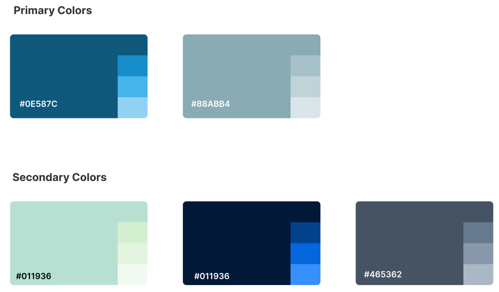

#### 4.1.2. Web Style Guidelines

**Diseño responsivo:**  
La interfaz de Sentinel se adapta fluidamente a desktop, tablet y mobile, asegurando una experiencia óptima en cualquier dispositivo.

**Componentes clave:**  
- Botones principales con esquinas redondeadas y colores contrastantes (azul principal con texto blanco), variantes para estados: default, hover, active y disabled.
- Formularios simples, con validación visual clara y mensajes de error amigables para el usuario.
- Iconografía minimalista y consistente, utilizando íconos lineales para funciones clave como alertas, historial, sensores y comunidad.
- Notificaciones diferenciadas por color para información, éxito y error, con opción de cierre manual.

**Accesibilidad:**  
- Contraste de color AA/AAA en todos los elementos interactivos.
- Textos alternativos en imágenes e íconos.
- Navegación accesible por teclado y foco visible en campos y botones.

**Consistencia:**  
La Landing Page y la Web App comparten la misma identidad visual: paleta de colores, tipografía Exo, estilo de botones e íconos, asegurando coherencia y reconocimiento de marca en toda la experiencia digital.

---
### 4.2. Information Architecture

En esta sección se definen las decisiones que organizan, nombran y estructuran la información dentro de la experiencia digital de Sentinel, tanto en la Landing Page como en la Web Application. El objetivo es que los usuarios encuentren fácilmente información sobre seguridad, puedan contratar planes, gestionar sensores y cámaras, y recibir alertas o reportar incidentes de forma intuitiva, accesible y sin fricciones.

#### 4.2.1. Organization Systems

**Jerárquico:**  
La información en Sentinel se organiza en niveles claros y progresivos: Inicio → Producto → Planes → Comunidad → Soporte → Contacto.

**Secuencial:**  
El flujo de contratación y activación del sistema sigue pasos definidos: elegir plan → registrar usuario → configurar sensores/cámaras → confirmar → activar protección y recibir acceso a la app.

**Categorización por audiencia:**  
- **Familias y personas que viven solas:** Planes básicos, guía de instalación y simulador de alertas.
- **Juntas vecinales y administradores:** Planes comunitarios, tablero de gestión, reportes y coordinación vecinal.
- **Autoridades locales y serenazgo:** Acceso a mapas de calor, reportes de incidentes y comunicación directa.

**Visual hierarchy:**  
Se priorizan los “call-to-action” (Contratar, Activar Alerta, Contactar Soporte) con botones destacados en el color primario azul (#0E587C).

Se incluyen nuevas secciones en la arquitectura: Beneficios, Videos demostrativos, y Conoce al Equipo (en la página ACERCA). Además, se añade una página separada de Términos y Recomendaciones accesible desde el footer.

#### 4.2.2. Labeling Systems

Uso de etiquetas claras, breves y consistentes.

**Ejemplos principales:**

- Inicio (Landing Page)
- Producto (Características, Beneficios)
- Planes (Básico / Comunitario / Avanzado)
- Comunidad (Gestión vecinal)
- Sensores (Configuración)
- Cámaras (Monitoreo)
- Alertas (Activar, Historial)
- Mi cuenta (Perfil, Configuración)
- Soporte (FAQ, Contacto en vivo)
- Beneficios
- Videos
- Conoce al Equipo
- Términos y Recomendaciones

Todas las etiquetas serán de máximo 2–3 palabras, evitando tecnicismos.

Todas las etiquetas de navegación y botones se estandarizan en español para el público local: Inicio, Producto, Planes, Comunidad, Sensores, Cámaras, Alertas, Mi cuenta, Beneficios, Videos, Conoce al Equipo, Soporte, Contacto, Términos y Recomendaciones.

#### 4.2.3. SEO Tags and Meta Tags

Se definen los metadatos básicos para mejorar el posicionamiento en buscadores:

**Landing Page**

Title: Sentinel | Seguridad inteligente para hogares y comunidades

Meta Description: Protege tu vivienda y tu comunidad con Sentinel, el sistema de seguridad IoT que integra sensores, cámaras y alertas inmediatas. Instalación rápida, monitoreo en tiempo real y coordinación con autoridades.

Keywords: seguridad inteligente, alarma IoT, Sentinel, ProtectX, protección vecinal, sensores, cámaras, Lima, comunidad segura

Author: ProtectX Startup

**Web Application**

Title: Sentinel App | Monitorea y gestiona tu seguridad en línea

Meta Description: Accede a tu cuenta Sentinel, configura sensores y cámaras, recibe alertas, reporta incidentes y coordina con tu comunidad y autoridades desde cualquier dispositivo.

Keywords: seguridad online, monitoreo IoT, Sentinel app, protección digital, alertas inmediatas, comunidad segura

Author: ProtectX Startup

#### 4.2.4. Searching Systems

**Buscador interno simple en la Web App**:

Palabras clave: “Planes”, “Alertas”, “Sensores”, “Cámaras”, “Comunidad”, “Soporte”.

Autocompletado con sugerencias relevantes.

**Filtros en alertas e incidentes:** por estado (Pendiente, En proceso, Resuelto) y por fecha.

FAQ con búsqueda rápida en el Landing Page para resolver dudas comunes (ej. “¿Cómo activar una alerta?”, “¿Cómo instalar un sensor?”, “¿Cómo contactar al soporte?”).

#### 4.2.5. Navigation Systems

**Landing Page:**

- Menú superior fijo con secciones principales: Inicio, Producto, Planes, Comunidad, Soporte y Contacto.
- Footer con enlaces a contacto, términos y recomendaciones, políticas de privacidad y redes sociales.
- Acceso directo a páginas externas como ACERCA y TERMINOS Y RECOMENDACIONES.
- Los accesos a Soporte y Contacto en el footer abren modales centrados en pantalla.
- Íconos de WhatsApp y correo electrónico permiten comunicación directa mediante enlaces reales a chat y email.

**Web Application:**

- Menú lateral en desktop con íconos y texto para navegación rápida entre módulos (Dashboard, Sensores, Cámaras, Alertas, Comunidad, Soporte).
- Menú hamburguesa en mobile para optimizar espacio y facilitar la navegación.
- Botones de acción rápida en el dashboard: Activar Alerta, Ver Sensores, Contactar Soporte.
- Navegación consistente entre Landing Page y Web App, manteniendo la misma paleta de colores, tipografía Exo y estilo de botones e íconos.

---
## 4.3. Landing Page UI Design  
### 4.3.1. Landing Page Wireframe  
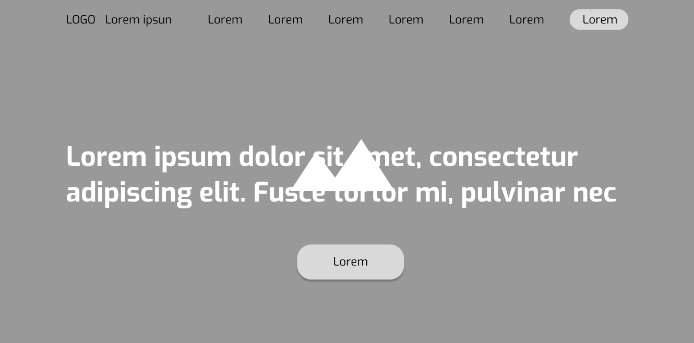

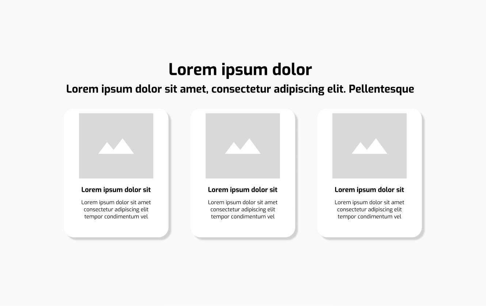

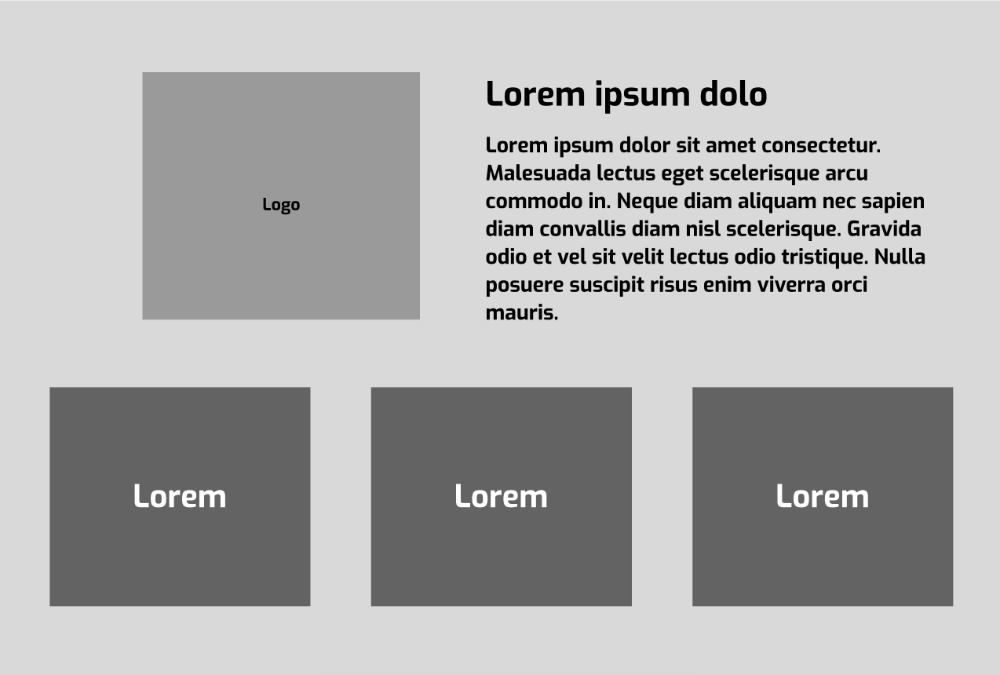
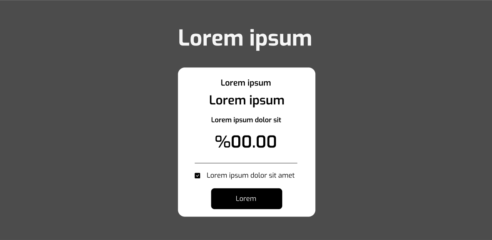
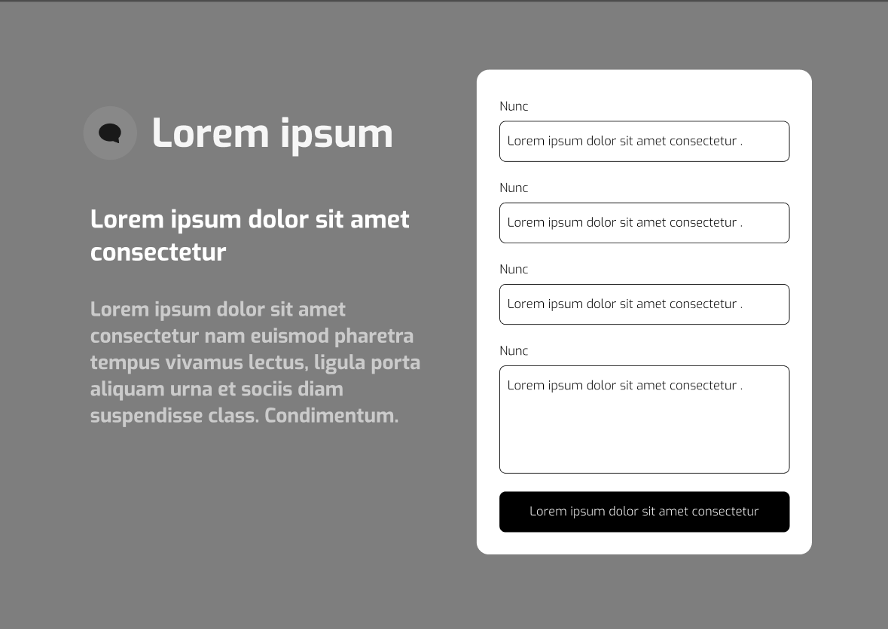
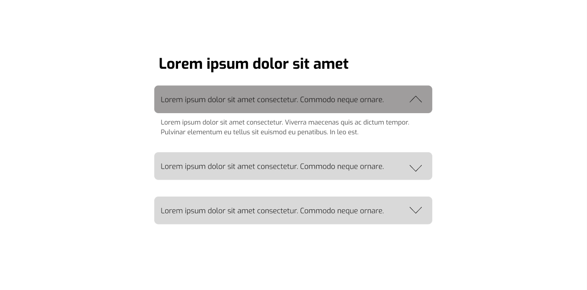
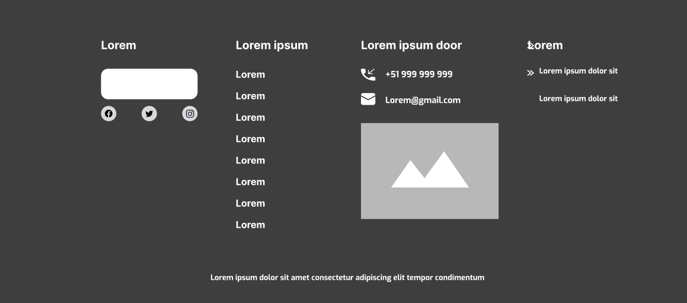

### 4.3.2. Landing Page Mock-up  
---
## 4.4. Web Applications UX/UI Design  
### 4.4.1. Web Applications Wireframes  
### 4.4.2. Web Applications Wireflow Diagrams  
### 4.4.3. Web Applications Mock-ups  
### 4.4.4. Web Applications User Flow Diagrams  
---
## 4.5. Web Applications Prototyping  
---
## 4.6. Domain-Driven Software Architecture  
### 4.6.1. Software Architecture Context Diagram

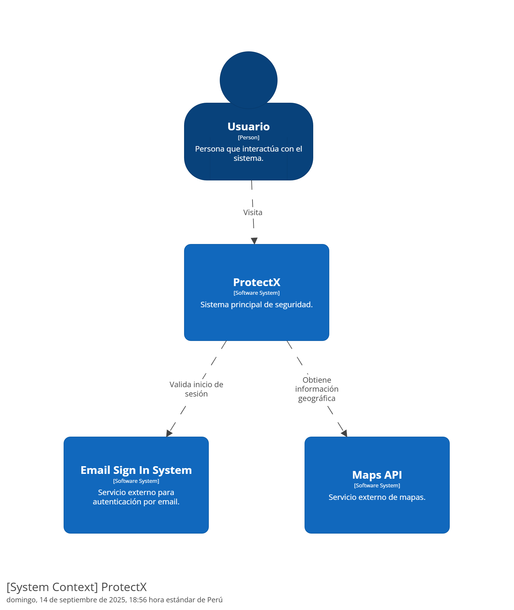

### 4.6.2. Software Architecture Container Diagrams 

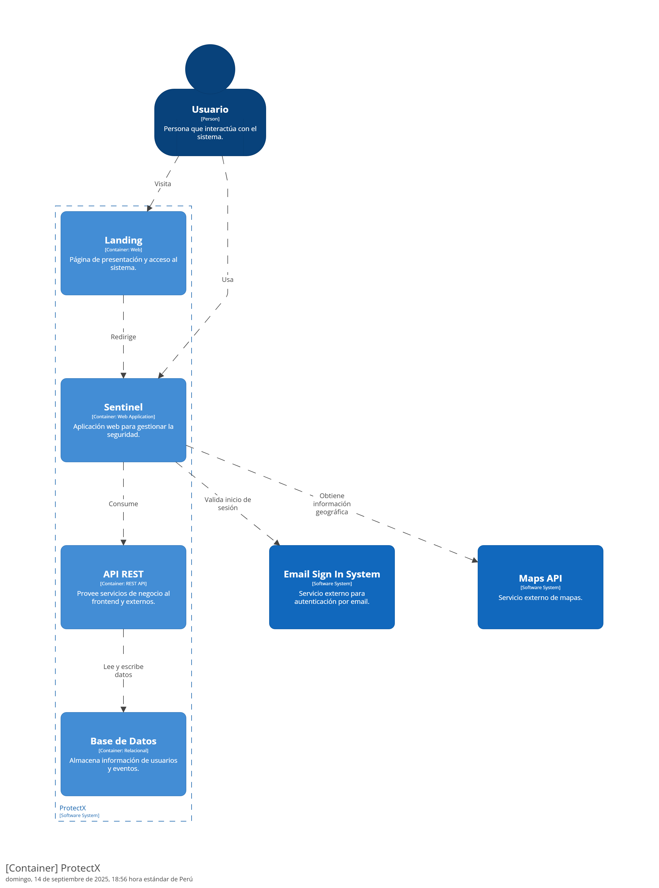

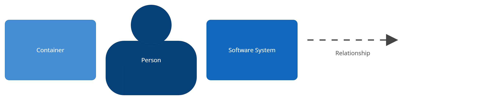

### 4.6.3. Software Architecture Components Diagrams  

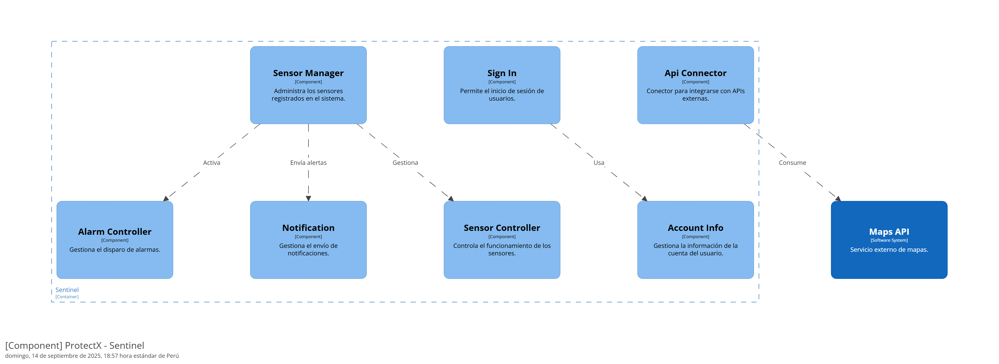

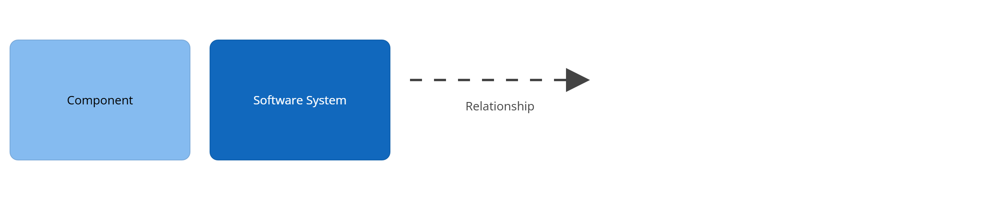

---
## 4.7. Software Object-Oriented Design  
### 4.7.1. Class Diagrams

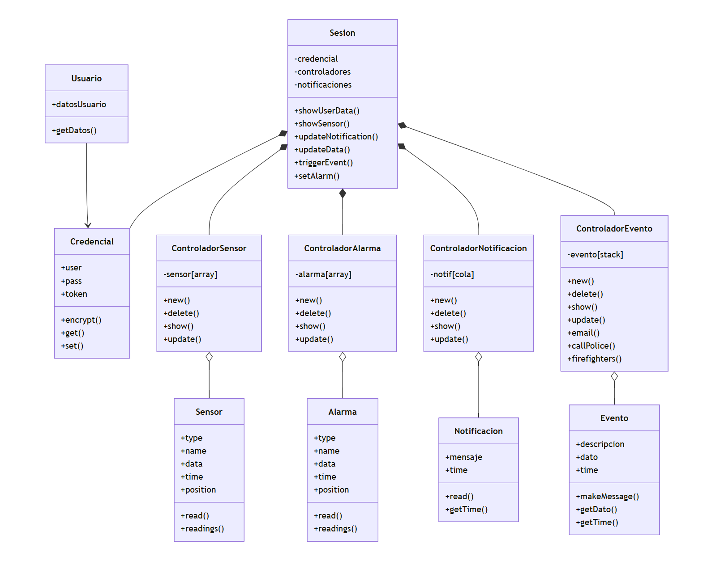

### 4.7.2. Class Dictionary 

### 4.7.2. Class Dictionary  

| Clase                  | Propósito                              | Atributos                                   | Métodos                                                                 |
|-------------------------|----------------------------------------|---------------------------------------------|-------------------------------------------------------------------------|
| Usuario                 | Representa a la persona del sistema    | `datosUsuario`                              | `getDatos()`                                                            |
| Credencial              | Maneja datos de acceso y seguridad     | `user`, `pass`, `token`                     | `encrypt()`, `get()`, `set()`                                          |
| Sesion                  | Gestiona la sesión activa del usuario  | `credencial`, `controladores`, `notificaciones` | `showUserData()`, `showSensor()`, `updateNotification()`, `updateData()`, `triggerEvent()`, `setAlarm()` |
| Sensor                  | Representa un dispositivo de medición | `type`, `name`, `data`, `time`, `position`  | `read()`, `readings()`                                                 |
| ControladorSensor       | Administra múltiples sensores          | `sensor[array]`                             | `new()`, `delete()`, `show()`, `update()`                              |
| Alarma                  | Representa un dispositivo de alerta    | `type`, `name`, `data`, `time`, `position`  | `read()`, `readings()`                                                 |
| ControladorAlarma       | Administra múltiples alarmas           | `alarma[array]`                             | `new()`, `delete()`, `show()`, `update()`                              |
| Notificacion            | Maneja mensajes del sistema            | `mensaje`, `time`                           | `read()`, `getTime()`                                                  |
| ControladorNotificacion | Administra notificaciones en cola      | `notif[cola]`                               | `new()`, `delete()`, `show()`, `update()`                              |
| Evento                  | Representa sucesos del sistema         | `descripcion`, `dato`, `time`               | `makeMessage()`, `getDato()`, `getTime()`                              |
| ControladorEvento       | Administra eventos en pila (stack)     | `evento[stack]`                             | `new()`, `delete()`, `show()`, `update()`, `email()`, `callPolice()`, `firefighters()` |

---
## 4.8. Database Design  
### 4.8.1. Database Diagram  

---

# Capítulo V: Product Implementation, Validation & Deployment  

## 5.1. Software Configuration Management  
### 5.1.1. Software Development Environment Configuration  
### 5.1.2. Source Code Management  
### 5.1.3. Source Code Style Guide & Conventions  
### 5.1.4. Software Deployment Configuration  
---
## 5.2. Landing Page, Services & Applications Implementation  
### 5.2.X. Sprint n  
#### 5.2.X.1. Sprint Planning n  
#### 5.2.X.2. Aspect Leaders and Collaborators  
#### 5.2.X.3. Sprint Backlog n  
#### 5.2.X.4. Development Evidence for Sprint Review  
#### 5.2.X.5. Execution Evidence for Sprint Review  
#### 5.2.X.6. Services Documentation Evidence for Sprint Review  
#### 5.2.X.7. Software Deployment Evidence for Sprint Review  
#### 5.2.X.8. Team Collaboration Insights during Sprint  
---
## 5.3. Validation Interviews  
### 5.3.1. Diseño de entrevistas  
### 5.3.2. Registro de entrevistas  
### 5.3.3. Evaluaciones según heurísticas  
---
## 5.4. Video About-the-Product  

---

# Conclusiones  

## Conclusiones y recomendaciones  

## Video About-the-Team  

---

# Bibliografía  
> Referencias en formato APA.  

---

# Anexos  
> Evidencias, capturas, diagramas adicionales.  

